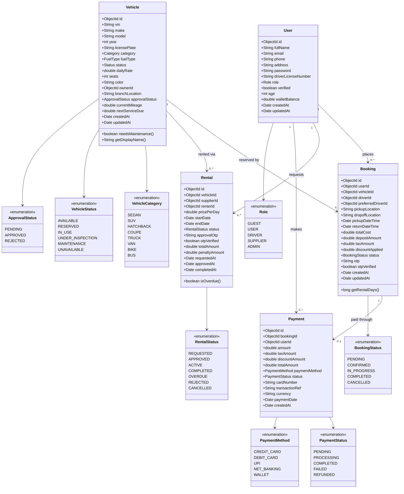
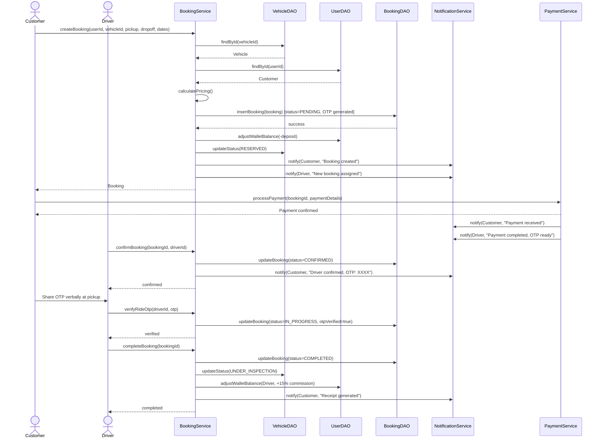
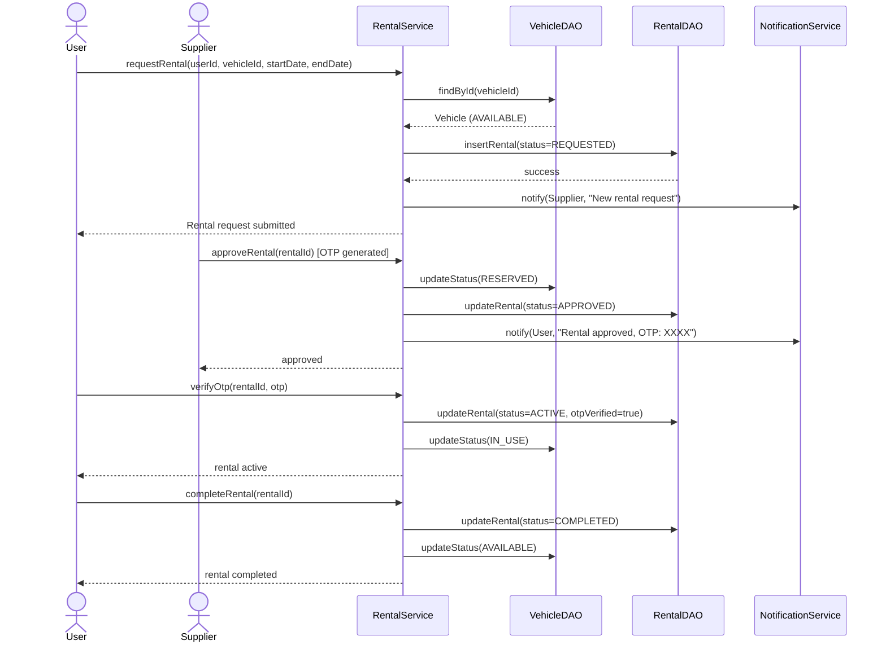
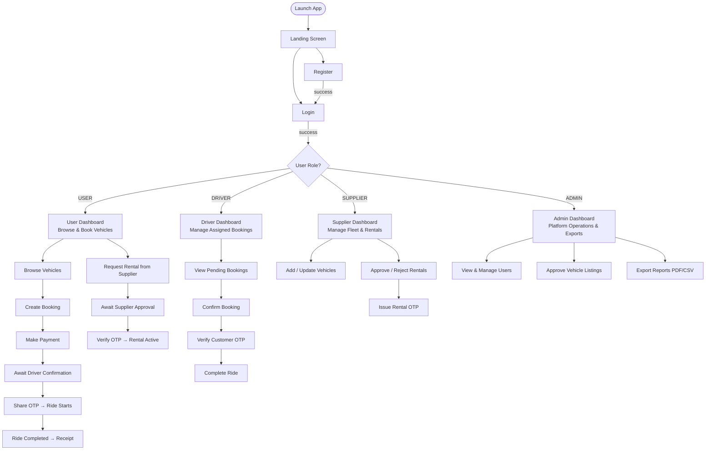

# Rento — UML Diagrams

## 1. Class Diagram (Domain Model)

---

## 2. Sequence Diagram — Booking Flow

---

## 3. Sequence Diagram — Rental Flow (Supplier)

---

## 4. Application Flow (Use-Case Overview)

